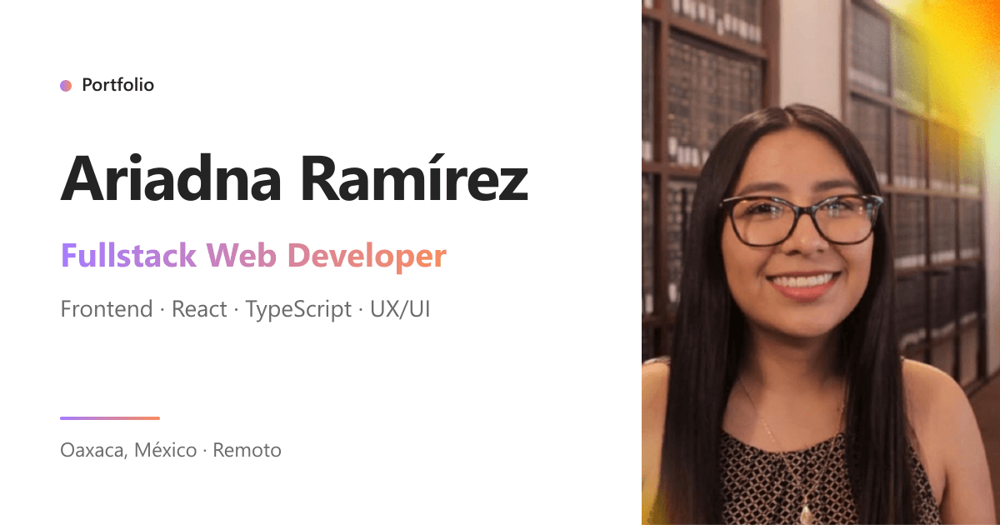

# Ariadna Ramírez · Portfolio

**Fullstack Web Developer | Frontend · React · TypeScript · UX/UI**

Construyo sitios y aplicaciones web con React y TypeScript: fáciles de usar y listos para publicar. De la idea a producción.

[Ver el sitio](https://ariadnaramirez.github.io/Portfolio/) · [LinkedIn](https://www.linkedin.com/in/ariadnaramirez) · [GitHub](https://github.com/AriadnaRamirez) · [ariadnamts98@gmail.com](mailto:ariadnamts98@gmail.com)



Abierta a roles Frontend / Fullstack y a proyectos freelance · Remoto, híbrido o presencial · UTC−6 · Español nativo, inglés avanzado (C1, TOEFL iBT 100/120).

---

## Proyectos

| Proyecto | Qué es | Stack | Enlaces |
|---|---|---|---|
| **Grupo CRM Extintores** | Sitio y catálogo de 50+ productos con cotización por WhatsApp y SEO local. Freelance, en producción. | HTML5 · CSS3 · JavaScript | [Sitio](https://www.crmextintores.com.mx/) · [Código](https://github.com/AriadnaRamirez/grupoCRM) |
| **Hotel Marqués del Valle** | Rediseño UX/UI y frontend bilingüe y multimoneda con la reserva a la vista desde cualquier página. Con GROVA, en producción. | Figma · React · TypeScript · Vite · Tailwind | [Sitio](https://www.hotelmarquesdelvalle.com.mx/) |
| **CCST Study Lab** | App de estudio para Cisco CCST que corrige en el servidor y repasa lo que más fallas. Diseño y desarrollo de web, API y base de datos. | Next.js · NestJS · TypeScript · PostgreSQL · Vercel · Render · Neon | [Sitio](https://ccst-study-lab.vercel.app/) · [Código](https://github.com/AriadnaRamirez/ccst-study-lab) |
| **SENDA** | Sistema de citas para varios comercios: formularios validados, errores claros y una interfaz propia para cada negocio. Con GROVA, cliente privado. | React · TypeScript · Vite · Formik · Yup · Zustand | Proyecto privado |
| **ServiYApp** | Marketplace de belleza a domicilio: login por rol, pago con Mercado Pago y el chat completo, del gateway en NestJS a la interfaz. Proyecto estudiantil en equipo de 6. | Next.js · TypeScript · NestJS · Socket.IO · OAuth | [Frontend](https://github.com/ServiYApp-Inc/ServiYApp-Frontend) · [Backend](https://github.com/ServiYApp-Inc/ServiYApp-Backend) |

Cada proyecto tiene su caso de estudio en el sitio, en `/work/crm/`, `/work/hmdv/`, `/work/ccst/`, `/work/senda/` y `/work/serviyapp/`.

## Stack

- **Frontend:** React · Next.js · TypeScript · JavaScript · Tailwind CSS · Zustand · Vite · HTML5 · CSS3
- **Backend & APIs:** Node.js · NestJS · REST APIs · WebSockets (Socket.IO) · JWT · Prisma · TypeORM · PostgreSQL
- **UX/UI:** Figma · Figma Make · UX Audit · Wireframing · Prototyping · Zod
- **Web, Cloud & AI:** Responsive · Performance · SEO · Vercel · Render · Neon · GitHub · Cursor · Codex

## Experiencia

- **Freelance Web Developer** · Trabajo independiente · Ago 2026 — actualidad · Remoto
- **Web Developer** · GROVA Marketing · Ago 2025 — Ago 2026 · Remoto (SENDA, Hotel Marqués del Valle, FitPlus)
- **Participante** · RAISE Summit Hackathon 2026 · Jul 2026 · Equipo internacional México–Argentina

## Formación y certificaciones

- Bootcamp Full Stack Web Developer · Henry
- Diplomado en UX/UI Design · EBAC
- Licenciatura en Ingeniería Civil · Universidad La Salle Oaxaca
- Graduate Studies in Civil Engineering · The University of Kansas
- Cisco Certified Support Technician (CCST) · Cisco Digital Badges · Python for Data Analysis · Programming with Python

## Servicios

Landing pages, sitios web para negocio, rediseños, catálogos de productos con cotización por WhatsApp, SEO local y aplicaciones web (sistemas internos, plataformas o un MVP). Cuéntame qué necesitas y en menos de 24 horas te envío una propuesta con alcance, costo y tiempos.

---

## Sobre este repositorio

El sitio está hecho con **Next.js 16** (App Router), **React 19**, **TypeScript** y **Tailwind CSS v4**, y se exporta como sitio estático a GitHub Pages.

- Bilingüe (ES / EN) y con modo claro y oscuro.
- Casos de estudio por proyecto, con galerías y comparativas de antes y después.
- CV en la web (`/resume`) y en PDF en español e inglés, generado con `@react-pdf/renderer`.
- SEO con metadatos, datos estructurados (JSON-LD), `sitemap` y `robots`.
- Analítica ligera con Umami.

### Estructura

```
portfolio/
├── public/              # imágenes, logos, capturas de proyectos y CV en PDF
├── scripts/             # generación del CV y utilidades del build
└── src/app/
    ├── components/      # secciones de la home, layout, casos de estudio, CV y UI
    ├── components/lib/translations.ts   # textos ES / EN
    ├── lib/             # datos del sitio: proyectos, casos de estudio, CV, SEO
    ├── work/            # páginas de cada caso de estudio
    └── resume/          # CV en la web
```

`COPYS-WEB.md`, en la raíz, reúne todos los textos visibles del sitio en ES y EN.

### Correr en local

```bash
cd portfolio
npm install
npm run dev        # http://localhost:3000
```

Otros comandos:

```bash
npm run build      # exporta el sitio estático a portfolio/out
npm run cv         # regenera los PDF del CV en public/cv
```

### Despliegue

Cada push a `main` ejecuta el workflow `.github/workflows/deploy-github-pages.yml`, que construye el sitio con `GITHUB_PAGES=true` (para servirlo bajo `/Portfolio`) y lo publica en GitHub Pages.

---

© Ariadna Ramírez
